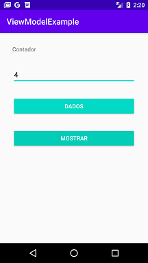

# ViewModel Example
Projeto desenvolvido no curso "ViewModel e Lifecycle para melhor experiência em aplicativos Android" do Bootcamp everis Kotlin Developer da [Digital Innovation One](https://digitalinnovation.one).

Este aplicativo simples foi feito com o objetivo de introduzir os conceitos de ViewModel no Android. 

## Instruções
Faça o clone ou o download do repositório e execute o aplicativo no Android Studio.

Há dois botões no aplicativo. O primeiro incrementa um contador e o segundo mostra o contador em um Toast.

Experimente rotacionar o dispositivo. Com o uso de ViewModel, mesmo após uma mudança de configuração, o aplicativo não perde o estado de suas variáveis.

## Screenshots
